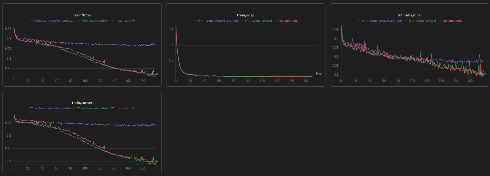
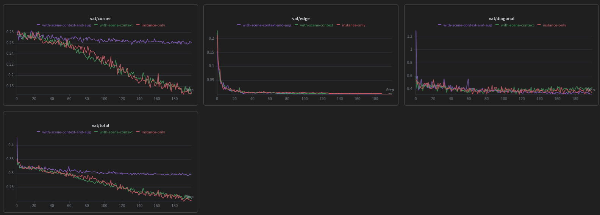
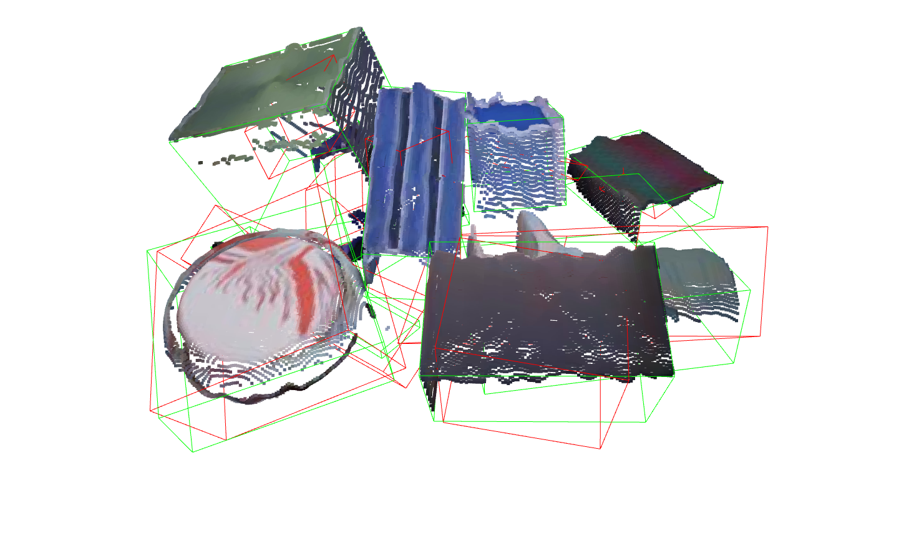
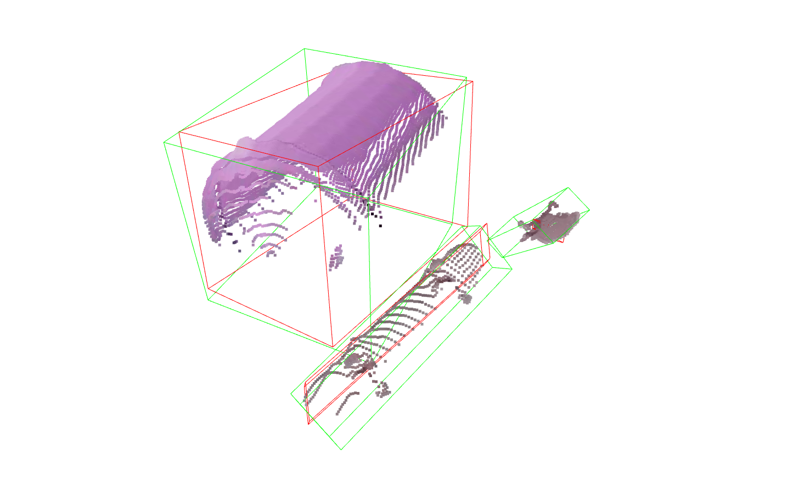

# 3D Bounding Box Prediction — Sereact Coding Challenge

End-to-end deep learning pipeline for predicting 3D bounding boxes of random parts in bins, using RGB images, point clouds, and instance segmentation masks.

---

## Table of Contents

- [Problem Overview](#problem-overview)
- [Pipeline Architecture](#pipeline-architecture)
- [Design Decisions](#design-decisions)
- [Repository Structure](#repository-structure)
- [Setup](#setup)
- [Usage](#usage)
- [Experiments & Results](#experiments--results)
- [Limitations & Future Work](#limitations--future-work)

---

## Problem Overview

Given a top-down bin-picking scene with industrial parts, the goal is to predict the **3D bounding box** of each part instance as 8 corner points in world coordinates `(N, 8, 3)`.

Each scene provides:
- `rgb.jpg` — color image (top-down view)
- `pc.npy` — dense XYZ point cloud `[3, H, W]`
- `mask.npy` — per-instance binary segmentation masks `[N, H, W]`
- `bbox3d.npy` — ground truth 3D bounding box corners `[N, 8, 3]`

The dataset contains **800 scenes** with approximately **1,400 valid object instances** after data cleaning.

---

## Pipeline Architecture


---

## Design Decisions

### Representation: Direct Corner Regression

The GT bounding boxes are provided as 8 corner points with full 3D rotations. Rather than decomposing into center + dimensions + rotation matrix (which requires careful linear algebra and a 6D rotation representation), we directly regress the 8 corner offsets in a **centroid-relative, unit-sphere-normalized** frame.

**Justification:**
- GT is already in corner format - no decomposition needed
- Centroid-relative frame keeps regression targets small and bounded
- Unit-sphere normalization makes inputs consistent across object sizes
- Simpler to implement and debug with limited time budget

**Trade-off:** No structural constraint guaranteeing a valid cuboid. Mitigated by the edge consistency and diagonal size regularization loss.

### Backbone: PointNet++

PointNet++ with Single-Scale Grouping (SSG) was chosen as the backbone. In its original implementation, each Set Abstraction (SA) layer uses Farthest Point Sampling (FPS) internally to select query points which is a fixed, input-agnostic strategy that treats all regions of the point cloud equally. 

**Modification: Anchor Point Injection.** Rather than letting each SA layer run its own FPS, the model accepts externally pre-sampled anchor points as an additional input. These anchors replace FPS as the query points for the ball grouping step. In practice, the instance point cloud (already isolated via the segmentation mask) is used as the anchor set. This ensures the SA layers query neighborhoods that are guaranteed to lie on the object of interest, rather than spending capacity on background regions that happen to be selected by FPS. 
This gives the caller explicit control over where local features are computed, which is particularly useful in the current application where the object boundaries are known precisely from the mask.
Additionally, providing only the segmented instance points doesn't give the model enough information about its shape. By providing scene points as context, the model gets more information on the overall shape and size of the instance points from the surrounding structure like the base of the bin or neighbouring parts.
Three SA layers progressively reduce the point count (1024 -> 256 -> 64 -> 1 global vector), with the final global pooling layer aggregating all remaining points into a single 1024-dim feature vector passed to the regression head. 

### Using Instance Masks for Cropping

The dataset provides instance segmentation masks. Rather than treating this as a full scene detection problem (with proposal generation), we use the masks to crop each object's point cloud before passing it to the model. This simplifies the problem to per-instance regression and lets the model focus entirely on shape-to-bbox mapping.

### Loss Function

Two terms are combined:

**1. Smooth L1 (Huber) Loss on corners:**
```
L_corner = SmoothL1(pred_corners, gt_corners)
```
Smooth L1 is more robust to outlier predictions early in training than MSE, preventing large gradient spikes.

**2. Edge Consistency Regularization:**
```
L_edge = mean variance of parallel edge lengths within each of 3 edge groups
```
A valid cuboid has 3 groups of 4 parallel edges that must be equal length. This term nudges predictions toward geometrically valid shapes without enforcing it hard.

**3. Diagonal Consistency Regularization:**
```
L_diagonal = SmoothL1(||pred[0] - pred[6]||, ||gt[0] - gt[6]||)
```
The diagonal connecting corners 0 and 6 (diagonally opposite) serves as a proxy for overall box scale. Penalizing the Smooth L1 difference between predicted and GT diagonal lengths encourages the model to learn correct object extents. Note this simplification assumes consistent corner ordering in the GT annotations.

**Total loss:**
```
L = L_corner + 0.1 * L_edge + 0.1 * L_diagonal
```

In practice, `L_edge` collapsed to near-zero by epoch 15, indicating the model quickly learned to predict cuboid-shaped outputs. `L_diagonal` behaved similarly to `L_corner` (remaining significant throughout training) suggesting it provided a useful complementary signal on overall box scale. The corner loss dominated learning throughout.

### Coordinate Frame

All model inputs and outputs are in a **centroid-relative, unit-sphere-normalized** frame:

```
centered  = points - centroid
scale     = max(||centered||)
normalized = centered / scale
```

At inference, predictions are converted back to world coordinates:
```
pred_world = pred_normalized * scale + centroid
```

Both `centroid` and `scale` are stored in each dataset sample and used in metric computation.

---

## Repository Structure

```
.
├── assets/                     # Images and assets
│   ├── pipeline_architecture.png
│   ├── train_losses.png
│   └── val_losses.png
├── config/
│   └── config.py               # Paths and cleanup thresholds
├── data/
│   ├── clean_data.py           # One-time script: filters invalid instances
│   ├── dataset.py              # BBoxDataset, get_split
│   ├── preprocessing.py        # load_scene, extract_instance_points, normalize, etc.
│   └── valid_instances.json    # Pre-computed list of valid (scene, instance_id) pairs
├── losses/
│   └── bbox_loss.py            # BBoxLoss: corner loss + edge consistency
├── models/
│   ├── detector.py             # BBoxDetector: PointNet++ backbone + MLP head
│   └── pointnet2_utils.py      # SA layers, FPS, ball query (adapted from Pointnet_Pointnet2_pytorch)
├── onnx_export/
│   ├── export_onnx.py          # Export + verify all checkpoints to ONNX
│   ├── best_model_instance-only.onnx
│   ├── best_model_with-scene-context.onnx
│   └── best_model_with-scene-context-and-aug.onnx
├── results/
│   ├── best_model_instance-only.json
│   ├── best_model_with-scene-context.json
│   └── best_model_with-scene-context-and-aug.json
├── utils/
│   ├── metrics.py              # mean_corner_distance, recall_at_threshold
│   └── visualization.py        # open3d visualization, mask overlay
├── checkpoints/                # Saved model weights (.pth)
├── train.py                    # Training loop with WandB logging
├── test.py                     # Evaluation on held-out test set
└── run_experiments.sh          # Shell script to reproduce all 3 runs
```

---

## Setup

```bash
# Create environment
conda create -n bbox_3d python=3.10
conda activate bbox_3d

# Install dependencies
pip install torch torchvision
pip install -r requirements.txt

# Place dataset under data/raw_data/
# Each scene is a folder: data/raw_data/<scene_uuid>/

# Run data cleanup (one time)
python data/clean_data.py
# Output: data/valid_instances.json
```

---

## Usage

### Training

```bash
python train.py [OPTIONS]
```

Key arguments:

| Argument | Default | Description |
|---|---|---|
| `--n_scene_points` | 8192 | Total points sampled per scene (scene context model) |
| `--n_instance_points` | 1024 | Points sampled per object instance |
| `--batch_size` | 16 | Training batch size |
| `--num_epochs` | 200 | Total epochs |
| `--lr` | 1e-3 | Initial learning rate |
| `--lambda_edge` | 0.1 | Edge consistency loss weight |
| `--lambda_diagonal` | 0.1 | Diagonal consistency loss weight |

In the current implementation, the following models were trained:
```bash
# Baseline: no scene points provided, only instance segmented points, no augmentation
python train.py --n_instance_points 1024 --batch_size 16 --num_epochs 200

# With scene context: scene points passed for adding more context of the overall scene
python train.py --n_scene_points 8192 --n_instance_points 1024 --batch_size 16

# With scene context and augmentation: enabled data augmentation for both scene and instance points
python train.py --n_scene_points 8192 --n_instance_points 1024 --batch_size 16 --augment
```

### Evaluation

```bash
python test.py
# Results saved to results/<model_name>.json
```

### Visualization

```bash
python utils/visualization.py
# Opens open3d viewer: Green = GT, Red = Prediction
```

### ONNX Export

```bash
python onnx_export/export_onnx.py
# Exports all checkpoints and verifies outputs against PyTorch
```

---

## Experiments & Results

Three model variants were trained and evaluated on the same held-out test set (120 scenes, ~200 instances).

### Training Setup

| Setting | Value |
|---|---|
| Optimizer | Adam, weight_decay=1e-4 |
| LR schedule | ReduceLROnPlateau, factor=0.5, patience=10 |
| Gradient clipping | max_norm=1.0 |
| Train / Val / Test split | 70% / 15% / 15% (scene-level) |

### Test Results

| Model | Mean Error | Median Error | Recall@50mm | Recall@100mm |
|---|---|---|---|---|
| Instance-only (baseline) | **72.8 mm** | **64.4 mm** | **37%** | **76%** |
| + Scene context | 72.0 mm | 68.3 mm | 33% | 74.5% |
| + Scene context + Augmentation | 104.0 mm | 96.6 mm | 3% | 52% |

> **Primary metric:** Mean corner distance in world coordinates (mm). Lower is better.
> **Recall@Xmm:** Fraction of instances with mean corner error below X mm.

### Training and Validation Curves




### Prediction Visualizations





### Observations

**Scene context did not help.** Adding surrounding scene points as context alongside the instance points showed no improvement. The solution could be to use Multi-Scale Grouping instead of Single-Scale Grouping and adding more Set Abstraction layes. Scene context would be more valuable in a proposal-free detection setup without masks.

**Augmentation hurt performance.** Random Z-rotation, uniform scaling, and point jitter degraded results significantly. The augmentation experiment was run for less number of epochs, and the model architecture used is likely too simple to learn invariances from augmented data. A deeper or wider network would be needed to generalize across the expanded input distribution. With more training data, more epochs and a more complex architecture, augmentation could become beneficial.

**Predicted cuboids are geometrically invalid.** The model learns to predict corner positions that are roughly in the right location and similar in scale, but the resulting shapes are often oblique, squished or sheared along the diagonal direction. This is a direct consequence of the bbox representation chosen: direct corner regression applies no structural constraint on the predicted geometry. While the edge consistency and diagonal losses encourage parallel edges of equal length, there is no loss term penalizing non-right angles between edges. A geometrically valid cuboid requires all adjacent edge pairs to be orthogonal, which is not enforced anywhere in the current pipeline. This was a known tradeoff when selecting the corner regression representation over a center + dimensions + rotation parameterization; the latter would structurally guarantee a valid cuboid by construction, at the cost of more complex decomposition and training.

---

## Limitations & Future Work

**Data limitations:**
- ~1170 training instances is insufficient for robust generalization with a randomly initialized backbone
- Pre-training on a larger point cloud dataset (e.g., ShapeNet) would significantly improve results

**Architecture improvements:**
- **MSG (Multi-Scale Grouping)** SA layers instead of SSG: captures local geometry at multiple radii, better for objects of varying sizes
- **6D rotation + center + dimensions** representation instead of direct corner regression: enforces structural validity of the cuboid
- **RGB fusion:** the RGB image was not used in any model variant. Fusing image features (via a 2D CNN) with point cloud features could help with texture-rich objects

**Training improvements:**
- Conservative augmentation (small rotations only, no Z-flipping) tuned to the fixed camera geometry
- Longer training with a cosine LR schedule
- Focal-style weighting to upweight hard instances (large errors)

**Deployment:**
- All three models are exported to ONNX (opset 18) and verified with ONNX Runtime
- The model contains a set_onnx_export() helper that switches all Set Abstraction layers from Farthest Point Sampling (FPS) to uniform sampling when set to True. FPS relies on a Python loop over the number of sampled points and is not traceable by the ONNX exporter, whereas uniform sampling replaces this with pure tensor operations that are fully traceable and produce a valid static graph. Since uniform sampling is deterministic given a fixed input, the exported model produces consistent outputs at inference time

- Next step: TensorRT conversion for deployment on Jetson or similar edge hardware

## Acknowledgements
- Pipeline architecture diagram generated with Google Gemini.
- PointNet++ SA layer implementation adapted from [Pointnet_Pointnet2_pytorch](https://github.com/yanx27/Pointnet_Pointnet2_pytorch).
